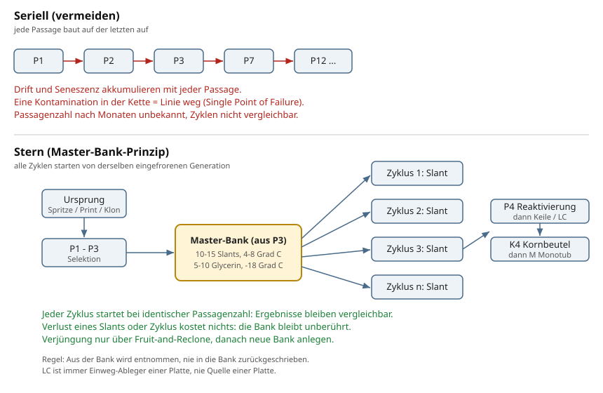

# Langzeitarchivierung: Master-Bank, Slants, Glycerin

[README.md](../README.md)

---

Dieses Dokument beschreibt, wie Genetiken langfristig gesichert werden,
wie daraus Platten und LC gezogen werden, und warum die Vermehrung
sternförmig statt seriell läuft.



## Warum ein Archiv

Myzel altert mit jeder Passage (Transfer auf neues Medium). Drei Risiken
akkumulieren bei fortlaufender Weitervermehrung:

1. Drift und Seneszenz: Jede Passage selektiert unbeabsichtigt (schnellste
   Front, nicht beste Fruchter) und altert die Kultur. Nach vielen Passagen
   sinken Vitalität und Ertrag, ohne dass ein einzelner Schritt als Ursache
   erkennbar wäre.
2. Single Point of Failure: Wer nur eine lebende Arbeitskultur hat, verliert
   bei einer Kontamination die ganze Linie.
3. Unbekannte Passagenzahl: Ohne fixen Referenzpunkt ist nach Monaten unklar,
   die wievielte Generation gerade fruchtet. Zyklen sind dann nicht
   vergleichbar; Ertragsänderungen lassen sich nicht zuordnen.

Die Master-Bank friert eine definierte Generation ein. Alle Produktionszyklen
starten von dieser Generation (Stern), nie vom vorherigen Zyklus (Serie).

## Zwei Archiv-Ebenen

### Arbeits-Bank: Schrägagar-Slants

- Format: 15-ml-PP-Röhrchen (122 Grad C / -80 Grad C tauglich), 5-6 ml MEA
  schräg erstarrt, Edelstahl-Rack
- Lagerung: 4-8 Grad C im Archiv-Kühlschrank, Deckel fest zu
  (dicht verhindert Austrocknung; Stoffwechsel bei Kühlschranktemperatur
  minimal, Restluft im Röhrchen reicht aus)
- Haltbarkeit: 1-2 Jahre zuverlässig, dann Refresh (siehe unten)
- Menge pro Linie: 10-15 Slants

### Deep Archive: Glycerin-Röhrchen

- Format: dieselben 15-ml-Röhrchen, 2-3 ml Glycerinlösung 15-20 %
  (Glycerin + Wasser, im Presto 20 min sterilisiert), darin 3-5 kleine
  Agarstücke mit vitalem Myzel von der Bank-Platte
- Glycerin wirkt als Gefrierschutz: verhindert Eiskristallbildung in den
  Hyphen beim Einfrieren
- Lagerung: -18 Grad C im Haushalts-Tiefkühler. Hinweis ehrlich: Bei -18
  hält das Jahre, nicht Jahrzehnte (Labore nutzen -80). Refresh-Rhythmus
  2-3 Jahre. Nicht in der Tür lagern (Temperaturzyklen beim Öffnen)
- Menge pro Linie: 5-10 Röhrchen
- Auftauen: Röhrchen bei Raumtemperatur auftauen, Agarstück auf frische
  MYA-Platte, 1-2 Wochen Geduld (Anlauf nach Frost ist langsam).
  Aufgetaute Röhrchen nie wieder einfrieren; Rest verwerfen

## Anlage einer Bank

Zeitpunkt: wenn eine Linie ihre Selektionsphase abgeschlossen hat (typisch
P3: verifiziert sauber, vital, aus dem besten Sektor selektiert).

In einer Flow-Hood-Session aus derselben P3-Platte:

1. 10-15 MEA-Slants beimpfen (kleines Keilstück je Röhrchen)
2. 5-10 Glycerin-Röhrchen befüllen (Agarstücke von derselben Platte)
3. Slants 1-2 Wochen bei 23 Grad C anwachsen lassen (Deckel lose),
   dann Deckel fest, ab in den Kühlschrank; Glycerin direkt einfrieren
   (Myzel auf den Stücken ist bereits vital)
4. Ereignis `banked` in runs/events.csv, alle Röhrchen in
   lineage/cultures.csv mit parent = Bank-Platte

Die Bank-Generation ist damit fixiert: Slants aus P3 sind S3, die spätere
Reaktivierungsplatte ist P4 - in jedem Zyklus, für immer.

## Entnahme: der Produktionsstern

Pro Produktionszyklus wird EIN Slant entnommen:

1. Slant aus dem Kühlschrank, unterm Flow Hood ein Stück auf MYA
   (= Reaktivierungsplatte, Generation Bank + 1, Ereignis `refreshed`)
2. Platte durchwachsen lassen (7-10 d), Vitalität beurteilen
3. Von dieser Platte: Keile in Kornbeutel (Standardweg) und/oder eine LC
   ansetzen (Tape-Injection-Weg). LC zählt als eigene Passage
4. Der Slant selbst ist verbraucht (einmal geöffnet = raus aus der Bank;
   Rest kann als Arbeitskultur dienen, geht aber nicht zurück ins Archiv)

Zwei Regeln, die den Stern vom Serienbetrieb trennen:

- Aus der Bank wird entnommen, nie zurückgeschrieben. Eine neue Bank
  entsteht nur aus einem bewussten Neuanfang (Reclone, neue Selektion).
- LC ist immer Einweg-Ableger einer Platte, nie Quelle einer Platte
  oder einer neuen LC. Submerse Passagen selektieren auf Fragmentierung
  statt Fruchtungsleistung (siehe protocols/lc.md).

## Refresh und Verjüngung

- Bank-Refresh (Slants altern): rechtzeitig vor Ablauf einen Slant
  reaktivieren, aus der Reaktivierungsplatte eine NEUE Bank anlegen.
  Die neue Bank ist eine Generation höher (S3 wird S4-Bank); das ist
  der Preis der Lagerung und wird im Code sichtbar.
- Verjüngung (Vitalität sinkt trotz Bank): Fruit-and-Reclone. Aus einem
  Monotub der Linie den besten Fruchtkörper klonen; der Klon liefert
  frisches somatisches Gewebe. Danach neue Selektion (P1-P3) und neue Bank.

## Notation

Vollständige Definition in protocols/events.md; hier die Anwendung:

Code: `Linie-TypGeneration-Datum[.Nr]`

- Linie: A, B, C ... Eine Linie = eine Genetik. Die Zuordnung
  (A = Strain-Name, Herkunft) steht im Kopf von lineage/cultures.csv
- Typ: P Platte, S Slant, G Glycerin-Röhrchen, L Liquid Culture,
  K Kornbeutel, M Monotub (Kurzform M-A1 = Box 1 der Linie A)
- Generation: Zahl der Passagen seit Ursprung der Linie. Sie wandert mit:
  P3 -> S3 (Slant konserviert die Generation) -> P4 (Reaktivierung ist
  eine Passage) -> K4 -> Box. LC aus P4 ist L5
- Datum: MMTT; Archivmaterial (S, G) mit Jahr: JJMMTT

Sonderfälle:

- Klon (Fruit-and-Reclone): genetisch dieselbe Linie, aber frisches Gewebe.
  Der Passagenzähler startet neu: A-P1 mit neuem Datum,
  note `Klon aus M-A1, Flush 2`. Die Historie trägt das parent-Feld
- Multispore (Print/Swab von eigenem Fruchtkörper): sexuelle Rekombination,
  also NEUE Genetik, darum neue Linie: B-P1, parent = M-A1,
  note `Multispore-Print`. Nie als Fortsetzung der Elternlinie führen
- Einzelsporen-Isolate aus einem Print: je Isolat eine eigene Linie
  (B, C, D ...), alle mit demselben parent

## Beispiel: Shop-LC protokollieren

Gekaufte LC ist Generation 0 der Linie (Herkunft unbekannt, Passagenzahl
des Shops unbekannt - Generation zählt ab unserem Eingang):

```csv
# lineage/cultures.csv
# Linien: A = Golden Teacher (Shop: XYZ, Bestellung 2026-09-15)
id,date,parent,medium,notes
A-L0-260915,2026-09-15,,lc,Shop XYZ; Spritze 10 ml; Charge lt. Etikett B231
A-P1-0918,2026-09-18,A-L0-260915,mya,Erstausstrich; Diagnose auf Glasschale
A-P2-0927,2026-09-27,A-P1-0918,mya,bester Sektor
A-P3-1005,2026-10-05,A-P2-0927,myra,sauber; Bank-Kandidat
A-S3-261012,2026-10-12,A-P3-1005,mea,Bank-Slant 1 von 12
A-G3-261012,2026-10-12,A-P3-1005,glycerin,Deep Archive 1 von 6
```

Später ein Klon aus einer Box dieser Linie (bleibt Linie A, Zähler neu):

```csv
A-P1-0312,2027-03-12,M-A2,mya,Klon Fruchtkörper Flush 1; Verjüngung
```

Später ein Print von einem Fruchtkörper (neue Genetik, neue Linie):

```csv
# Linien: B = Multispore aus M-A2 (Eigenzucht)
B-P1-0405,2027-04-05,M-A2,mya,Multispore-Print vom 2027-03-20
```

Damit bleibt jede Frage beantwortbar: Welche Generation fruchtet gerade?
(Zähler der Box-Herkunft.) Woher stammt Linie B? (parent-Kette bis zum
Shop-Eintrag.) Wie alt ist die Bank? (Datum der S-Einträge.)

---

[README.md](../README.md)
